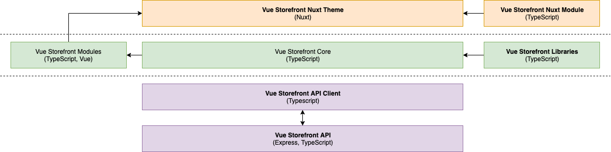

# Vue Storefront 2 (Turbo ^^)

## Reasons behind the project

In short words - currently Vue Storefront is flooded with technical debt, bad architectural decisions that are very hard to redo and unnecesary complexity. We came to the point when it's easier to write a project from scratch and take into account all our learnings there instead of adjusting architecture of 1.x.

## High level goals

Vue Storefront Next should be buuilt the way that will ensure dealing with following challenges (wchich are learnings from 1.x)
- Simple one-command installation
- Seamless updates (!)
- Easy maintanance of core and VS projects
- Ability to quickly build PoCs and standard shops
- Extendibility and ability to build non-standard solutions
- Flexibility in tools/3rd parties to let us swap technologiese
- Scalability 
- Better enviroment for "native" VS integrations (like Shopware)
- "Printing" good practises in a project so it's hard to make a project that doesn't run smooth and has bad performance.
- Not being tied to any 3rd party solution - everything should be optional and replaceable
- Being sure that software works well without heavy manual testing
- Great performance (incl slow 3G)

Before every architectural decision we should make sure that it's making it easier for us to achieve all of those goals.

Vue Storefront 2.x should be a **framework** (so we provide building **blocks**) with theme working as out of the box implementation with basic configuration. It will be extended by dedicated modules for third-party integrations.

## High-level rules for project architecture

We defined set of high-level architectural rules that are meant to fulfill above requirements. Their main purpose is to make sure that project is easy to maintain, extend and every decision is reversable.

- Project should have decoupled, and layered architecture to ensure that every of it's parts is encapsulated and communicates with outside world only via strictly declaired public API. Implementation details of given module shouldn't influence those APIs.
- Every potentially repalceable third party integration API used in core building blocks (api client, core) should be abstracted so we can easily swap it with other solution solving the same problem. Modules and 3rd parties shouldn't be directly used. instead we should use dependency injection with standarized interfaces to make sure that implementation details of any module is not influencing other ones.
- Additional complexity should be avoided whenever possible (including unnecesary abstractions for uncertain future goals!)
- Core package must be tree-shakeable (by feature) which implies multiple ES modules for libraries/modules.
- We group code by **features** not file/entity types so it's easier to add/remove/edit certain capabilities of Vue Storefront.

## High-level architecture

Project should be devided into standalone parts with certain responsibilities. In fact architecture may look very similar to Vue Storefront 1.x but certain parts responsibilities are much different now.

Every layer should expose public API for input/output operations that is not tied to implementation details. Use of every service should be reversable which means we shouldn't base any modules behavior on implementation details of another module.

We decided to divide project into following parts:

- **Vue Storefront API** is the same API as in 1.x. Old frontend logic wiull be moved there to avoid client-side complexity.
- [**API Client**](./rfc/api-client.md) is a client-side micro-application built to consume Vue Storefront API.
- [**Vue Storefront Core**](./rfc/core.md) is main package of Vue Storefront that glues modules and libraries together.
- [**Core libraries**](./rfc/libraries.md) are certain functionalities for Vue Storefront core supporting it's functionality with non-eCommerce features.
- [**Core modules**](./rfc/modules.md) are official eCommerce functionalities and integrations exposed as Vue hooks. 
- [**Third party modules**](./rfc/extendibility.md) are third-party integrations exposed as Vue Hooks.
- [**Vue Storefront Nuxt Module**](./rfc/nuxt-module.md) is a module that installs Vue Storefront in your project and set of Vue Storefront enhancements for Nuxt.
- [**Nuxt Theme**](./rfc/nuxt-theme.md) is ready to use implementation of Vue Storefront with additional features provided by Nuxt Module. Using Nuxt theme is a recommended way of building shops with Vue Storefront 

Such architecture will ensure that Vue Storefront is decoupled and not tied to any specific platform or library. With properly structured public APIs and dependency injection every element of the architecture (library, module, even API client) should be replaceable and can be maintained in spearation without affecting other parts of the system.

Even though using Nuxt Theme with Nuxt Module is recommended way of using Vue Storefront it should be possible to use just Vue Storefront Core in any project (also without ssr) **without additional work**. Every layer should work by itself when layer above it is removed (so core should work without a theme, api client without core etc).

## Problems and solutions

While building Vue Storefront 2 we need to face many challenges known from previous version. Below you can find detailed informations about most important ones:

**NOTE** Some solutions may slightly or highly chance if they fail to serve their purpose or prevent us from reaching any of project goals.

- [Maintainability]()
- [Extendibility]()
- [Updateability]()
- [Performance]()
- [Images]()
- [Browser support]()
- [Integrations]()
- [Configuration]()
- [Coding standards]()
- [Definition of done]()
- [Testing]()
- [Documentation]()

## Ideas

### Unified data formats for CMS/eCommerce

Right now to make best use of the new platform we need to make dedicated integration which implies special theme for every new platform. It's obviously not the bests cenario as we need to provide new theme for every major platform which leads to code duplication and harder maintenance. Ideally we could agree on some common data formats for most common parts of the UI and return them from Hooks. That way it's much easier to maintain multiple integrations.