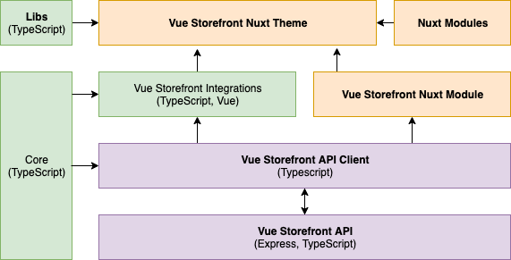

# Vue Storefront 2.0

## Reasons behind the project

In short words - currently Vue Storefront is flooded with technical debt, bad architectural decisions that are very hard to redo and unnecesary complexity. We came to the point when it's easier to write a project from scratch and take into account all our learnings there instead of adjusting architecture of 1.x.

## High level goals

Vue Storefront 2.0 should be buuilt the way that will ensure dealing with following challenges (wchich are learnings from 1.x)
- Simple installation
- Seamless updates
- Easy maintanance of core 
- Smallest possible complexity
- Good Developer experience
- Ability to repalce/extend any part of the application
- Some level of unification with "native" VS integrations (like Shopware)
- "Printing" good practises in a project so it's hard to make a project that doesn't run smooth and has bad performance.
- Great performance
- Tests

Before every architectural decision we should make sure that it's making it easier for us to achieve all of those goals.

## High-level rules for project architecture

To ensure coverage of every possible use case Vue Storefront 2 needs to be a **framework**. Developers should be able to replace and remove every part of the system that they need.

We defined set of high-level architectural rules that are meant to fulfill above requirements. Their main purpose is to make sure that project is easy to maintain, extend and every decision is reversable.

- Project should have decoupled, and layered architecture to ensure that every of it's parts is encapsulated and communicates with outside world only via strictly declaired public API defined in core. Implementation details of given module shouldn't influence those APIs.
- Additional complexity should be avoided whenever possible (especialy unnecesary abstractions for uncertain future goals)
- Core package must be tree-shakeable.
- We group code by **features** instead of file types so it's easier to add/remove/edit certain capabilities of Vue Storefront.
- For current magento/agnostic integration most of the eCommerce complexity should be on the API level

## High-level architecture

Project should be devided into isolated parts with strictly defined responsibilities.

Every part of the system should expose public API for input/output operations that is not tied to it's implementation details. Use of every service should be reversable which means we shouldn't base any modules behavior on implementation details of another module. To ensure every part is working well with others we will define interfaces in Core package.

:::tip
Using **Nuxt Theme** with **Nuxt Module** is recommended way of using Vue Storefront and we shouldn't encourage people to experiment with other options. Most of the features will require Nuxt but we should provide an option for using bare VS modules or even bare VS API Client for those who need it without any issues (so with a single comman installation). It's meant mostly for very custom projects that don't need most of our features and complexity.
:::

We decided to divide project into following parts:

- **Vue Storefront API** has same responsibility as in 1.x except it will be much richer in business logic. most of current vuex logic will be moved there.
- [**API Client**](./rfc/api-client.md) is a client-side micro-application built to consume APIs. 
- [**Vue Storefront Core**](./rfc/core.md) is a shared package of Vue Storefront that glues libraries together and exports interfaces for modules and API clients.
- [**Core libraries**](./rfc/libraries.md) are certain functionalities for Vue Storefront core supporting it's functionality with non-eCommerce features. They are part of the core package.
- [**Modules**](./rfc/modules.md) are 3rd party system (eCommerce, cms) integrations exposed as Vue hooks. 
- [**Vue Storefront Nuxt Module**](./rfc/nuxt-module.md) is a module with a set of Vue Storefront enhancements for Nuxt.
- [**Nuxt Theme**](./rfc/nuxt-theme.md) is ready to use implementation of Vue Storefront with additional features provided by Nuxt Module. Using Nuxt theme is a recommended way of building shops with Vue Storefront 

Such architecture will ensure that Vue Storefront is decoupled and not tied to any specific platform or library. With properly structured public APIs and dependency injection every element of the architecture (library, module, API client) should be replaceable and can be maintained in spearation without affecting other parts of the system.

## Problems and solutions

While building Vue Storefront 2 we need to face many challenges known from previous version. On the right hand side you can find detailed informations about most important ones.
:::warning
 Some solutions may slightly or highly change if they fail to serve their purpose or prevent us from reaching any of project goals.
:::
