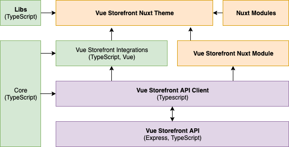

:::tip tl;dr

New Vue Storefront should be modular and have strictly defined API. We should be able to work on each of them in separation without worrying that it will break other parts of the system. Users should be able to cut off functionalities they don't need without any problem. At bare minimum Vue Storefront should be able to work with any JavaScript application and framework. On top of this we will build additional "layers", each adding complexity and new features.

Typical Vue Storefront shop will be using Nuxt Theme and Nuxt Module which will provide a working shop tempplate (Theme) and additional functionalities (Nuxt Module). Theme will be using Vue Storefront Hooks (in Vue Storefront integrations) to get product, category, cms and other data.

Vue Storefront core is just a set of interfaces that will be used by
- Vue Hooks (Product, Category, CMS etc) to provide common denominator between multiple platforms
- API clients to provide common approach to APIs and standarized way of configuration

We should also avoid complexity and make VS as simple as possible.
:::

## High level goals

- Simple installation
- Seamless updates
- Easy maintanance of core 
- Smallest possible complexity
- Good Developer experience
- Ability to repalce/extend any part of the application
- Some level of unification with "native" VS integrations (like Shopware)
- "Printing" good practises in a project so it's hard to make a project that doesn't run smooth and has bad performance.
- Great performance
- Good test coverage and testing tools for community

Before every architectural decision we should make sure that it's making it easier for us to achieve all of those goals.

## High-level rules for project architecture

To ensure coverage of every possible use case Vue Storefront 2 needs to be a **framework**. Developers should be able to replace and remove every part of the system that they need.

Here is a set of high-level architectural rules that are meant to fulfill above requirements. Their main purpose is to make sure that project is easy to maintain, extend and every decision is reversable.

- Project should have decoupled architecture to ensure that every of it's parts is encapsulated and communicates with outside world only via strictly declaired public API defined in core. Implementation details of given part shouldn't influence those APIs.
- We should provide common interfaces for replaceable platform-specific parts to make it easier to maintain multiple platform integrations and learn Vue Storefront.
- Additional complexity should be avoided whenever possible (especialy unnecesary abstractions for uncertain future goals)
- Core package must be tree-shakeable.
- For current magento/agnostic integration most of the eCommerce complexity should be on the API level

## High-level architecture

Project should be devided into isolated parts with strictly defined responsibilities.

Every part of the system should expose public API for input/output operations that is not tied to it's implementation details. Usage of every service should be reversable which means we shouldn't base any modules behavior on implementation details of another module. To ensure every part is working well with others we will define common interfaces in core package.

:::tip
Using **Nuxt Theme** with **Nuxt Module** is recommended way of using Vue Storefront and we shouldn't encourage people to experiment with other options. Most of the features will require Nuxt but we should provide an option to use bare VS core or even bare VS API Client without any issues (so with a single comman installation). It's meant mostly for very custom projects that don't need most of our features and complexity.
:::

Project should be divided into following parts:

- **Vue Storefront API** 
- [**API Client**](./rfc/api-client.md) 
- [**Vue Storefront Core**](./rfc/core.md) 
- [**Core libraries**](./rfc/libraries.md) 
- [**Core/3rd party Integrations**](./rfc/integrations.md) 
- [**Vue Storefront Nuxt Module**](./rfc/nuxt-module.md) 
- [**Nuxt Theme**](./rfc/nuxt-theme.md)

:::warning
 Some solutions may slightly or highly change if they fail to serve their purpose or prevent us from reaching any of project goals.
:::
