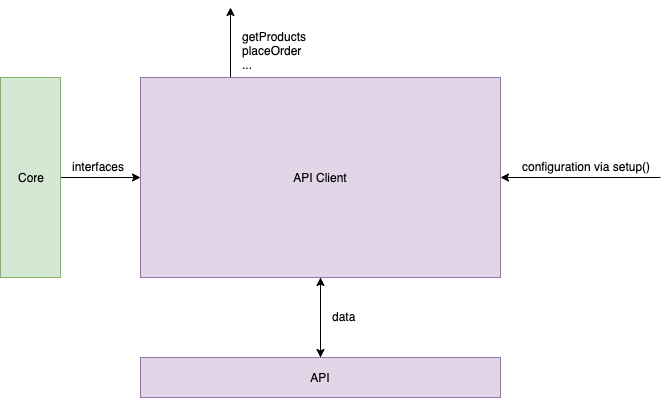

# API Client package
:::tip tl;dr
API client provides a friendly abstraction layer over network calls and their configuration. By using it we can hide implementation details of **how** we get the data and just expose declarative API to be consumed by other apps. With that we can easily do things like switching from ES to GQL without introducing breaking cahnges

Every integration should use it's own API client. Core is exposing common interface that every API Client should use to ensure common way of configuring requests, headers etc  (there is only one interface for`setup()` function which is global API configuration). API Clients will be using axios.

API client is one of two parts of eCommerce/CMS integration. Second one is an integration that exposes Vue hooks. API client is not mandatory but we should promote writing dedicated API clients as a good practice to ensure that every integration is configurable

**Every API client is a standalone package that can be used in any JavaScript project.**.
:::

## Responsibilities

API client responsibility is just to make an abstraction over API data operations and it's configuration.

## Architecture


**Input**
- data from Vue Storefront API
- configuration from`setup()` function where you can set basic axios properties and modify endpoints.
- API Client interfaces from core

**Output**
- functions for data resolution (like `getProduct`, `makeOrder` etc)
- `setup` function

## API

### Initialization with `setup()`

With this method we can setup global configuration for every request. You can pass every `axios.create()` ([ref](https://github.com/axios/axios#axioscreateconfig)) option here.

API Client ships with default configuration that can be overwritten by the user (so usually the only thing you add is `baseURL`)

**NOTE** Not certain yet
There is also `resolvers` object letting users modify every axios request to VS API. Every resolver is in a form of [axios request](https://github.com/axios/axios#request-config).

**Examples**

**NOTE** `setup()` is needed only if you want to use API Client standalone. For Nuxt apps those options are hoisted into Nuxt config.
Setting up application just with `baseURL`
```js
setup({
  baseURL: 'https://some-domain.com/api/'
})
```
Setting up advanced configuration and overriding (for future versions)

```js
setup({
  baseURL: 'https://some-domain.com/api/',
  timeout: 1000,
  headers: {'X-Custom-Header': 'foobar'}
})
```

### Getting data

Every request is just a axios request. You can override any request params just by passing axios properties to method arguments.

#### Available methods

`getProduct`
- `id`
- `include`
- `exclude`

`getProducts`
- `filters` - based on product attributes (color, size etc)
- `from`
- `to`
- `include`
- `exclude`

`getCategories`
- `filters`
- `from`
- `to`
- `include`
- `exclude`

---

`createCart`
- `token` - guest cart token

`addToCart`
- `items`

`removeFromCart`
- `items` - list of unique id's

`applyCoupon`
- `code`

`removeCoupon`
- `code`

---

`placeOrder`
 - `personalDetails`
 - `shippingMethod`
 - `shippingDetails`
 - `paymentMethod`
 - `paymentDetails`

 ---

 `logIn`
 - `email`
 - `password`

`logOut`
- `token`

`register`
- `login`
- `password`
- `userData`

`forgotPassword`
- `email`

`profile`
- `token`


**Examples**

Get all categories (default behavior)
```js
import { getCategories } from '@vue-storefront/api-client'

let categories;

getCategories().then({ data } => categories = data)
```

Modify request to get categories
```js
import { getCategories } from '@vue-storefront/api-client'

let categories;

getCategories({ params: { filter: { id: 123 }}})
  .then({ data } => categories = data)
```

You can find implementation of API Client [here](./ntegrations.html#example)

## To consider

- exporting `axios.interceptors` for network interceptors
